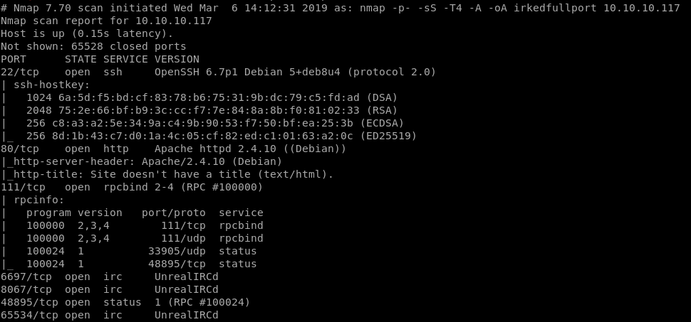
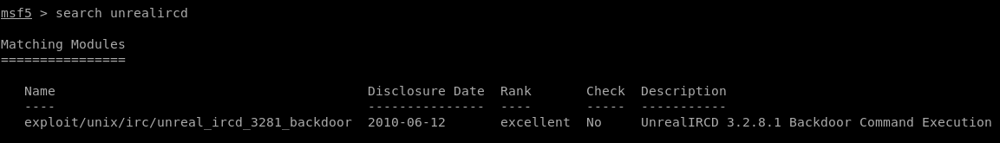
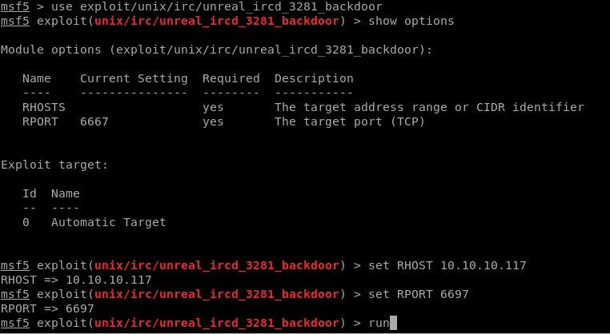
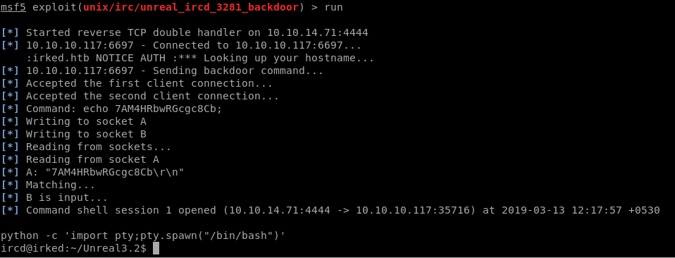
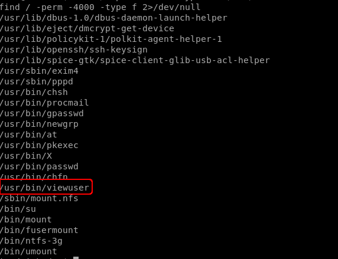
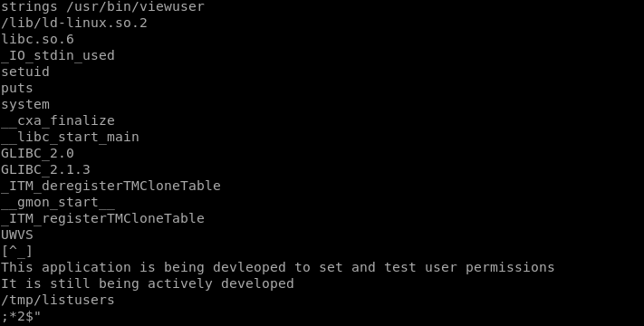
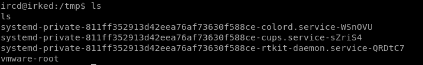
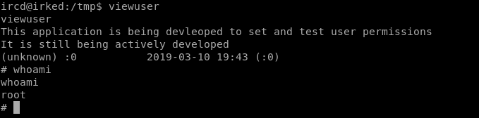

# IRKED
## Info

IP Address: 10.10.10.117  
OS: Linux  
Difficulty: Easy  

## System Enumeration

### NMAP

Using `nmap`, we check for open ports on the machine  


Noticing a common and old backdoor which can be exploited, I went directly for it.  

## Using the Metasploit

Looking up `UnrealIRCD`, we find an existing exploit in metasploit, which makes our work easier than it has to be.  



### Using the Exploit





And we are in!   

But we don't have any user permissions, yet!  

So let's go for basic privilege escalation.  

## Privilege Escalation

Checking out system info using `uname -a` 

```
Linux irked 3.16.0-6-686-pae #1 SMP Debian 3.16.56-1+deb8u1 (2018-05-08) i686 GNU/Linux
```
Looking for SUID binaries using  
`find / -perm -4000 -type f 2>/dev/null`

The `viewuser` binary seems to be different than usual, let's check it out.  


It's just calling `/tmp/listusers`  

Checking the contents of `tmp`


Since there's no `listusers`, we can create one and use it to elevate our privileges.  


## Rooted

Finally, calling `viewuser`, we finally get root  




