# LightWeight

## Info
  * IP : 10.10.10.119
  * OS : Linux
  * Diffculty: Easy/Medium

## System Enumeration

### NMAP

### Web App Enumeration

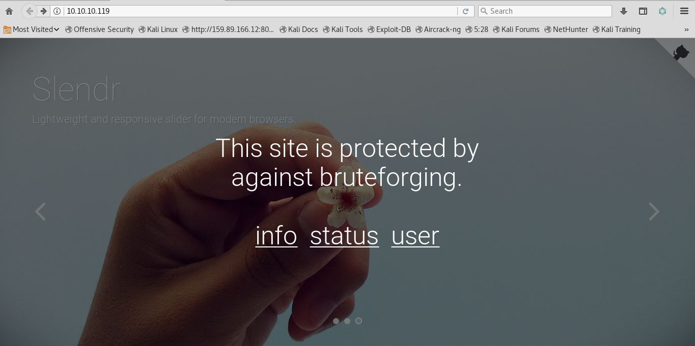

#### user.php

#### status.php

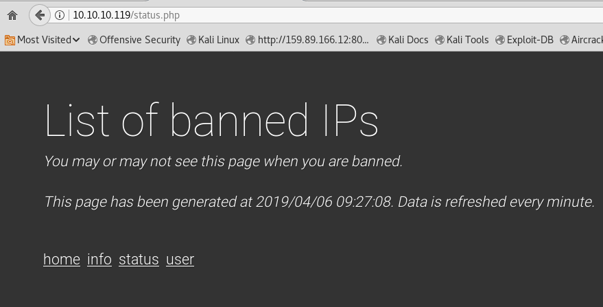

So we see that we can log in to the box using our IP and SSH.  
After logging in, there was nothing special to look for in the box, so I tried a `tcpdump`.  
	   `tcpdump -i lo -vv -nn -w capture.pcap`

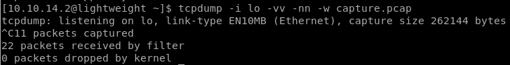

We see traffic being captured, when we open `http://10.10.10.119/status.php`  
    
Using `scp` to transfer the captured pcap file to my local pc, I opened it up in wiresharkhttps://gist.github.com/bcoles/421cc413d07cd9ba7855

#### WireShark

Since, we know that this machine is related to `LDAP`, I directly checked the `.pcap` file for any LDAP requests and luckily enough

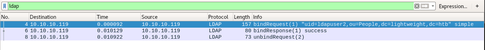  
Looking further, we find a possible authentication hash for `ldapuser2`  
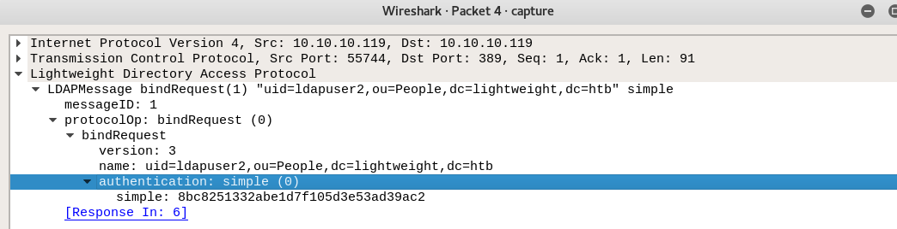

## User Exposed

Elevating to `ldapuser2` using `su` and the hash as password, we log in easily. Thus, exposing `user.txt`

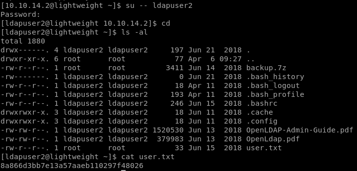

### Backup.7z

In the home folder of `ldapuser2`, there's a 7zip file named backup, which means it might contain some information for us.  

Downloading the file and extracting it.  
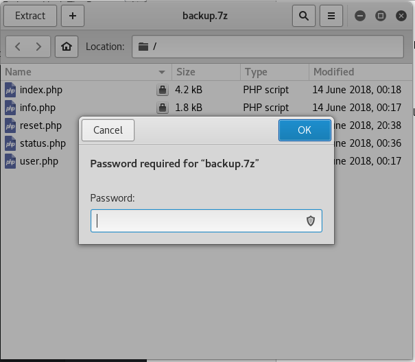  

So it's locked and we have to decrypt it.  
I found a simple and straightforward script on github to do the job for me.(https://gist.github.com/bcoles/421cc413d07cd9ba7855)  

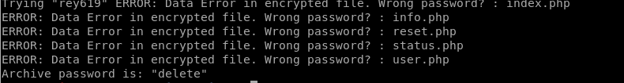

We got new files! Let's check them out.  

### Status.php

So, the status.php file reveals some more information to us 

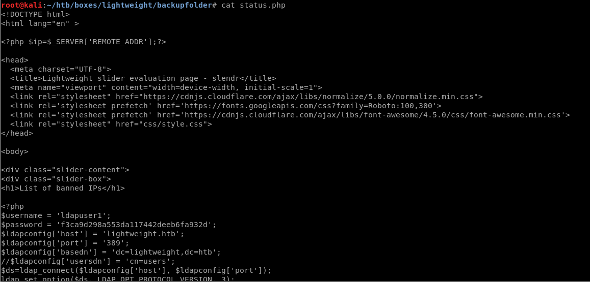

## Going for Root

We now have both the passwords for ldapuser1 and ldapuser2, but still no root access or `root.txt`

### General Enumeration

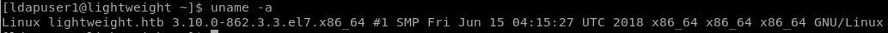

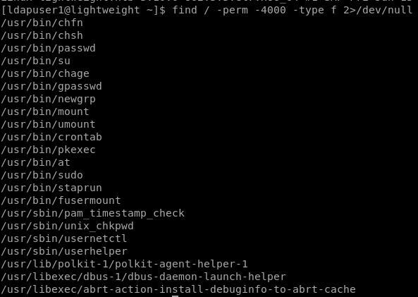

### Linux Capabilities

Since, there was nothing peculiar I checked for linux capabilities using `getcap -r / 2>/dev/null`  
It seems openssl has empty capabilities, that means we can use it to access any file. 

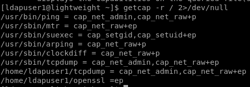 

So there are 2 ways we can go about this:  
  * Get root.txt
  * Get root shell by changing sudoers

### Getting root.txt

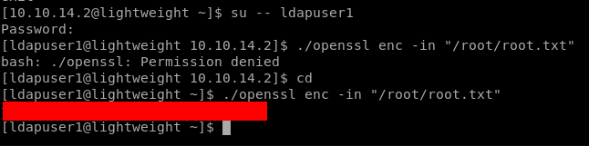

### Changing Sudoers

So we create our own sudoers using `./openssl enc -in "/etc/sudoers" -out sudoers`  

Editing this sudoers file to:  
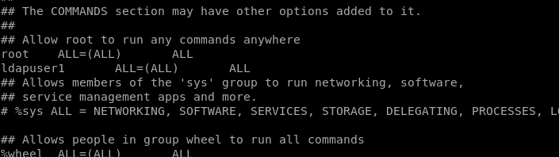

Changing the original sudoers file and getting root shell.  

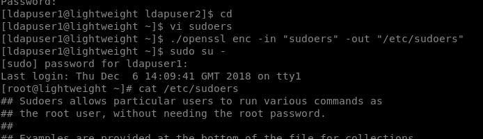

Thank you for following!
